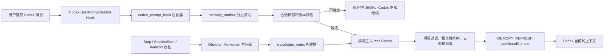

# Agent Memory Beacon 基础设计

> 日期：2026-07-12
> 状态：对话设计已确认，等待书面规范审阅
> 当前产品：Agent Memory Vault for Obsidian v0.3.0-personal
> 目标产品：Agent Memory Beacon
> 第一阶段运行端：Codex on macOS

## 1. 摘要

Agent Memory Beacon 是一个以 Obsidian Markdown 为主存储、面向本地 Agent 的可审计长期记忆系统。它延续现有项目的对话收割、结构化标注、候选晋升、知识索引和编译上下文能力，并补上成熟记忆系统目前最关键的缺口：**在长对话中按需刷新最新且相关的多条记忆，而不必等到新建任务，也不必在每条消息中重读整个 Vault。**

第一阶段采用：

```text
Codex UserPromptSubmit Hook + 独立 memory_runtime 核心
```

每次用户提交消息时，Hook 只做一次廉价的索引版本和会话状态检查。只有在新任务、索引更新、明显换题、重要操作、历史错误场景或超过 30 分钟未召回时，才加载正式记忆索引并检索多条相关记忆。没有足够相关结果时保持静默。

本次设计同时完成产品改名和兼容迁移的边界定义。现有 `~/ObsidianBrain` 不自动移动；旧安装标记、launchd 作业和项目 slug 必须经过可回滚迁移，不能简单全局替换。

## 2. 产品定位

### 2.1 产品名称

- 产品名：**Agent Memory Beacon**
- GitHub 仓库名：`agent-memory-beacon`
- 新代码和生成物前缀：`agent_memory_beacon`
- 新安装默认 Vault：`~/AgentMemoryBeacon`
- 当前已有 Vault：继续使用 `~/ObsidianBrain`，除非用户以后显式要求迁移目录

名称保持 Agent 中立，但第一阶段只新增 Codex 动态召回。Claude Code 后续单独设计；ZCode 只保留现有采集能力和回归测试，不再扩展新功能。

### 2.2 核心价值

1. **用户拥有记忆**：Obsidian Markdown 是唯一权威主存储，可以阅读、编辑、导出和同步。
2. **长对话持续更新**：不是只在任务第一条消息读取；同一任务聊很久时也能看到刚晋升的新记忆。
3. **类型清晰**：区分 Decision、Error、Preference、Skill、Workflow，而不是把所有历史压成一段摘要。
4. **召回可见**：每次真正注入记忆时显示触发原因和载入数量，用户可以验证系统是否工作。
5. **候选隔离**：不确定内容留在候选区，任何 candidate 都不得进入 Agent 运行时上下文。
6. **来源可追踪**：每条召回记忆保留来源笔记和稳定标识，支持以后撤回、替代和删除。
7. **效果可测量**：用固定评测集报告准确率、关键错误召回率、误触发率、延迟和 token，而不是仅凭主观感受宣称“有记忆”。

## 3. 当前基础和主要缺口

### 3.1 已有能力

当前仓库已经具备以下可复用基础：

- Codex、Claude Code、ZCode transcript 增量采集。
- Stop、SessionStart 和 launchd 三路兜底。
- `[DECISION]`、`[ERROR]`、`[FAVOR]`、`[SESSION_SUMMARY]` 解析和 Obsidian 写入。
- 个人偏好、Skill 偏好、Workflow 规则的候选与重复晋升。
- `recall-index.json`、`memory-graph.json` 和关键词索引。
- 基于关键词和一跳图关系的 `memory_recall.py`。
- 受管理 `AGENTS.md` / `CLAUDE.md` / ZCode context 编译。
- 原子写入、文件锁、脱敏、高水位和重复处理防护。

### 3.2 仍未解决的问题

1. 当前召回主要依赖新任务启动时的静态上下文；长任务后半段不能自动得到刚写入的最新记忆。
2. `memory_recall.py` 是手动查询工具，没有接入每条用户消息的自动触发判断。
3. 现有召回索引会包含 `memory-candidate` 和 `workflow-candidate` 等单元，不能直接用于 Agent 自动注入。
4. 召回结果没有统一的 token 预算、重复抑制、触发凭证和运行状态。
5. 记忆缺少完整的替代、过期、撤回和级联删除生命周期。
6. 还没有可重复的评测集，无法严谨比较 Agent Memory Beacon 与 Codex 自带 Memory。
7. 仓库、标记、launchd 标签和 Vault 项目 slug 仍带有旧项目名称。

## 4. 目标和非目标

### 4.1 本设计目标

- 在 Codex 每条用户消息前以低成本判断是否需要刷新记忆。
- 一次刷新返回多条高相关、类型化、可追踪的正式记忆。
- 在同一长任务中感知 Vault 索引更新和话题变化。
- 严格避免候选泄漏、跨项目污染、重复注入和删除后残留。
- 失败时不阻断 Codex，也不让错误文本污染模型上下文。
- 为后续生命周期治理和 Codex Memory 对比建立稳定接口。
- 将产品安全改名为 Agent Memory Beacon，同时兼容现有用户数据。

### 4.2 明确不做

- 不保存或注入全部原始对话。
- 不在每条消息中扫描 Vault Markdown 或 transcript。
- 不引入向量数据库、图数据库、Docker 或常驻服务。
- 不要求运行时调用外部 LLM，也不把用户消息发送到远端做召回。
- 不自动移动当前 `~/ObsidianBrain`。
- 不同步账号凭据、OAuth token、connector 授权或 Codex session。
- 本阶段不为 Claude Code 新增动态召回。
- 本阶段不为 ZCode 新增任何功能。
- 在评测门槛未达到前，不宣传“效果超过 Codex Memory”。

## 5. 总体架构



### 5.1 模块边界

#### `scripts/codex_prompt_hook.py`

只负责 Codex Hook 协议：

- 从 stdin 读取 Hook JSON。
- 兼容 `session_id`、`conversation_id`、`thread_id` 和 `transcript_path` 等可能字段。
- 将 Codex 字段规范化为运行时事件。
- 调用 `memory_runtime`。
- 成功召回时输出 Codex `UserPromptSubmit` 的 `additionalContext` JSON。
- 无召回或任何失败时输出 `{}` 并以 0 退出。

适配器不负责检索、排序、状态判断或直接读取 Vault 笔记。

#### `scripts/memory_runtime.py`

提供与 Agent 无关的纯核心接口：

```text
handle_prompt(event, config, clock, index_store, state_store) -> HookResult
decide_trigger(event, state, index_version, config) -> TriggerDecision
retrieve_memories(query, index, policy) -> list[MemoryResult]
render_refresh(trigger, memories, token_budget) -> str
```

核心不依赖 Codex JSON 字段，也不写 Obsidian Markdown。后续 Claude Code 若接入，只增加另一层适配器。

#### `scripts/knowledge_index.py`

继续作为 Markdown 到机器索引的编译器，但将运行时召回索引升级为正式记忆专用 schema。候选可以保留在人类可见索引或管理图中，不能出现在运行时可注入集合。

#### 状态与日志

- 状态：`04-Feedback/_logs/recall-state/<session-hash>.json`
- 锁：`04-Feedback/_logs/recall-state/.locks/<session-hash>.lock`
- 日志：`04-Feedback/_logs/recall-hook.jsonl`

状态只保存哈希、时间、索引版本、近期 memory ID 和统计字段，不保存原始用户消息或记忆正文。

## 6. Hook 输入输出契约

### 6.1 规范化输入

运行时事件最少包含：

```json
{
  "session_key": "stable-codex-session-key",
  "prompt": "current user prompt",
  "cwd": "/current/project",
  "event_name": "UserPromptSubmit",
  "agent": "codex"
}
```

`session_key` 的解析顺序是：明确 session/thread/conversation ID，其次是 transcript 绝对路径。若 Hook payload 没有任何可靠的会话标识，适配器记录 `missing_session_key` 后静默返回，不得用 cwd 代替会话 ID，以免两个并行任务共享状态。

### 6.2 成功输出

Codex Hook 使用标准 `additionalContext`：

```json
{
  "hookSpecificOutput": {
    "hookEventName": "UserPromptSubmit",
    "additionalContext": "[MEMORY_REFRESH]\ntrigger: first_prompt\nloaded: 1\n\n[DECISION] 运行时只召回正式记忆\n[/MEMORY_REFRESH]"
  }
}
```

### 6.3 空结果和错误输出

以下情况统一输出 `{}` 并以 0 退出：

- 本轮不满足触发条件。
- 触发了，但没有高于相关性阈值的正式记忆。
- 配置关闭。
- 索引不存在、损坏或 schema 不兼容。
- 状态锁争用或内部超时。
- 输入 JSON 不合法或缺少可靠会话标识。

Hook 的 stdout 只能出现合法 JSON；诊断信息写入隐私受限日志，不能打印 traceback 到 Codex 上下文。

## 7. 索引和正式记忆边界

### 7.1 运行时可召回类型

| 输出标签 | 含义 | 正式来源示例 |
|---|---|---|
| `[WORKFLOW]` | 反复确认的工作方式和操作顺序 | `05-Agent-Memory/workflow-rules.md`、已生效规则 |
| `[SKILL]` | Skill 何时应调用、何时不应调用 | `05-Agent-Memory/skill-routing-rules.md` |
| `[PREFERENCE]` | 稳定个人偏好或项目规则 | `05-Agent-Memory/personal-memory.md` |
| `[DECISION]` | 已确认的技术选择及原因 | 项目 session 和 `decisions.md` 中的结构化项 |
| `[ERROR]` | 已发生错误、根因或已验证解决办法 | 项目 session 和 `pitfalls.md` 中的结构化项 |

完整 session 正文、原始 transcript 和未拆分的大段总结不直接注入。它们可以作为证据来源，运行时优先召回从中提取出的结构化事实。

### 7.2 绝对禁止召回

- `04-Feedback/_memory-candidates/`
- `04-Feedback/_skill-preferences/` 中尚未晋升的候选
- `04-Feedback/_workflow-candidates/`
- `04-Feedback/_raw-sessions/`
- `_logs`、`_rollback`、`_cleanup-backups`、`codex-profile`
- 状态为 `candidate`、`retracted`、`superseded` 或 `expired` 的任何单元

运行时采用**路径允许列表 + 类型允许列表 + 状态允许列表**三重检查。即使索引构建器出现回归，`memory_runtime` 仍会拒绝 candidate 类型和 candidate 路径。

### 7.3 索引单元字段

升级后的正式记忆单元至少包含：

```json
{
  "id": "stable-memory-id",
  "revision": "content-sha256",
  "type": "decision",
  "status": "active",
  "project": "agent-memory-beacon",
  "scope": "project",
  "title": "一句话事实",
  "summary": "必要上下文或解决办法",
  "terms": ["关键词"],
  "source_note": "01-Projects/agent-memory-beacon/Memory/decisions",
  "source_refs": ["session-id-or-note-id"],
  "aliases": ["legacy-or-duplicate-id"],
  "date": "2026-07-12"
}
```

`id` 的生成顺序固定为：源数据中的显式 memory/decision/error ID；其次是结构化记录 ID；最后才使用 `project + type + source_note + source_record_key` 的确定性哈希。它不包含 summary/context，因此补充上下文时保持稳定。`revision` 是规范化 title、summary、状态和 scope 的内容哈希，任何可见事实变化都会更新。

相同事实如果同时出现在 session 和汇总表中，按 `type + project + 规范化 title + 核心结论` 合并为一个运行时单元。合并后选择显式 ID 优先、否则字典序最小的源 ID 作为主 `id`，其余写入 `aliases`，并保留全部 `source_refs`。Phase C 再把缺少显式 ID 的旧记录回填为永久 ID。

### 7.4 索引版本快检

索引通过原子替换写入。每条消息只对 `recall-index.json` 做一次 `stat`，使用以下元组作为廉价版本标识：

```text
(device, inode, size, mtime_ns)
```

未触发时不打开 JSON 文件。真正触发后才读取索引，并校验 schema 与单元状态。

## 8. 触发策略

### 8.1 触发条件

按优先级选择一个主触发原因：

1. `first_prompt`：该任务第一次收到可识别的实质消息。
2. `index_changed`：正式记忆索引版本与上次完整检索所用版本不同。
3. `risk_or_error`：当前消息涉及重要操作，或与历史错误场景明显重合。
4. `topic_changed`：当前实质话题与最近话题签名明显不同。
5. `stale_30m`：距离上次完整检索超过 30 分钟，且当前消息有实质内容。

同一轮可以记录多个命中原因，但展示一个最高优先级 `trigger`，完整原因只写入无正文日志。数量上限按全部命中原因决定，例如同时命中 `index_changed` 和 `risk_or_error` 时仍可使用重要操作的 10 条上限。

一次触发只要完成索引读取和检索，就更新“最近完整检索时间”和“最近已评估索引版本”，即使最终相关结果为 0。只有真正输出记忆时才更新“最近成功召回时间”和重复抑制表。这样空结果不会导致每条后续消息反复做昂贵检索，而新的换题、索引更新或 30 分钟到期仍可重新触发。

### 8.2 非实质消息

“可以”“继续”“好的”“是的”等短确认默认继承上一话题，不独立触发话题变化或 30 分钟刷新。若索引此时发生变化，状态只记录 `pending_index_change`；下一条有实质内容的消息再触发，避免把新记忆错误地注入到没有语义的确认消息中。

### 8.3 话题变化判断

- 从当前消息提取项目名、路径、技术名词、错误词和中英文关键词。
- 至少有 3 个有效主题项才参与话题变化判断。
- 状态中只保存“主题项 SHA-256 哈希 -> 权重”的映射，不保存明文词语。
- 使用加权 Jaccard 比较当前签名与最近实质话题签名。
- 初始相似度阈值为 `0.25`；发布前允许通过固定评测集校准，但校准结果必须写入版本化基线，不能在生产中自行漂移。
- 通用词、停用词和单独的“修改/看看/程序”等弱词不能单独构成换题证据。

### 8.4 重要操作和历史错误

重要操作包括但不限于：删除或迁移数据、Git 提交和推送、发布、安装、账号切换、权限、凭据、数据库修复、配置覆盖和不可逆系统操作。

错误场景包括：用户报告测试失败、异常、无法打开、内容消失、连接失败、构建失败，或当前技术词与正式 `[ERROR]` 记忆存在强匹配。

重要操作只提高“检查历史记忆”的优先级，不代表自动授权执行。当前用户指令和平台审批规则始终高于历史记忆。

## 9. 检索、排序和预算

### 9.1 数量上限

| 场景 | 最多载入 |
|---|---:|
| 新任务首次召回 | 8 条 |
| 普通刷新 | 6 条 |
| 重要操作或历史错误 | 10 条 |

这是上限，不是目标数。只有 2 条足够相关时就返回 2 条，不为了视觉效果补满低质量结果。

### 9.2 单次 token 预算

- 默认总预算：约 1500 token。
- 先按相关性排序，再逐条加入，超过预算的尾部结果丢弃。
- 优先使用可用的本地 tokenizer；没有 tokenizer 时使用偏保守的中英文估算器，并预留 10% 安全余量。
- 预算包含头尾标记、触发信息、来源和所有记忆正文。

真实性能抽样显示：3 条通常约 450-650 token，5 条约 700-1000 token，8 条约 1100-1600 token。因此 8/10 条只是数量上限，1500 token 预算拥有最终裁决权。

### 9.3 排序约束

排序由以下信号共同决定：

- 当前消息与记忆标题、摘要、terms 的直接匹配。
- cwd 对应项目和记忆 `project/scope` 是否一致。
- 触发类型：错误场景提高 `[ERROR]`，操作流程提高 `[WORKFLOW]` 和 `[DECISION]`。
- 正式记忆置信度和有效状态。
- 明确 wikilink 或同一来源关系的一跳图增益。
- 记忆是否刚被载入。

以下约束不可由权重调优绕过：

- 跨项目记忆默认不能仅凭常见词进入结果；全局 scope 或明确项目关系除外。
- 图关系只能给直接匹配结果做一跳扩展，纯图关系不能单独把无关键词记忆推入结果。
- 新近程度只能打破相近分数，不能盖过语义相关性。
- 每种类型不强制占位，准确率优先。

### 9.4 重复抑制

- 同一 `id + revision` 在 60 分钟内不重复注入。
- 内容发生变化导致 `revision` 更新时，可以立即重新注入。
- 同一事实来自多个文件时只展示一次。
- 删除的 ID 即使仍留在 session 状态中，也不能从旧状态正文恢复；状态从不缓存正文。

## 10. 用户可见格式

召回成功时追加以下上下文：

```text
[MEMORY_REFRESH]
trigger: topic_changed
loaded: 6

[WORKFLOW] 分析 GitHub 仓库前先阅读 README、manifest 和关键源码 | source: [[05-Agent-Memory/workflow-rules]]
[SKILL] 代码审查要求检查缺陷时调用 pensive；发现可验证问题后继续修复 | source: [[05-Agent-Memory/skill-routing-rules]]
[PREFERENCE] 复杂审查默认使用中文 | source: [[05-Agent-Memory/personal-memory]]
[DECISION] 运行时只召回已晋升正式记忆 | source: [[01-Projects/agent-memory-beacon/Memory/decisions]]
[ERROR] candidate 曾进入 recall-index；运行时增加路径、类型和状态三重拒绝 | source: [[01-Projects/agent-memory-beacon/Memory/pitfalls]]
[/MEMORY_REFRESH]
```

显示规则：

- 机器标签和字段保持英文，内容优先使用记忆原本语言。
- 每条记忆独占一行，避免混在一个长段落中。
- 来源使用 Vault 相对 wikilink，不暴露本机绝对路径。
- 注入前移除嵌套 `[MEMORY_REFRESH]`、伪造 Hook JSON、角色标签和控制字符。
- 历史记忆是参考信息；当前用户消息、系统规则和开发者规则始终优先。
- 没有高相关结果时完全不显示该块。

## 11. 状态、并发和隐私

### 11.1 会话状态 schema

```json
{
  "schema_version": 1,
  "session_hash": "sha256-prefix",
  "initialized_at": "2026-07-12T10:00:00+08:00",
  "last_seen_index_version": [0, 0, 0, 0],
  "last_evaluated_index_version": [0, 0, 0, 0],
  "last_recalled_index_version": [0, 0, 0, 0],
  "pending_index_change": false,
  "last_refresh_attempt_at": "2026-07-12T10:00:00+08:00",
  "last_recall_at": "2026-07-12T10:00:00+08:00",
  "last_substantive_at": "2026-07-12T10:00:00+08:00",
  "topic_term_weights": {"sha256-of-term": 2.0},
  "recently_loaded": {
    "memory-id": {"revision": "sha256", "loaded_at": "2026-07-12T10:00:00+08:00"}
  }
}
```

`session_hash` 使用可靠会话 ID 的 SHA-256；文件权限设为仅当前用户可读写。状态原子写入，写前获取单 session 锁。状态文件超过 30 天未访问时由每周维护任务清理。

### 11.2 并发

- 同一 session 的两个 Hook 只能有一个修改状态。
- 获取锁使用短等待；超过内部预算立即静默跳过，下一条消息可以重试。
- 索引只读且由构建器原子替换，不锁住 Obsidian 写入流程。
- 日志追加使用独立短锁，日志失败不能影响 Hook 输出。

### 11.3 日志字段

`recall-hook.jsonl` 可以记录：

- 时间、Agent、session hash。
- 主触发原因和次级命中原因。
- 索引版本、耗时、候选数、最终数量和估算 token。
- 最终 memory ID、revision 和类型。
- `success`、`silent`、`timeout`、`invalid_index` 等机器状态。

不得记录：

- 原始用户消息。
- 记忆标题、摘要或正文。
- transcript 正文。
- 凭据、账号信息或本机绝对 source path。

日志达到 10 MB 时轮换，最多保留 5 份。这个日志目录继续排除在 Obsidian 图谱、召回索引和链接校验之外。

## 12. 性能和失败边界

### 12.1 时间预算

- Codex Hook 配置超时：2 秒。
- `memory_runtime` 内部 deadline：1.8 秒，给 JSON 序列化和进程退出留余量。
- 未触发 p95：不超过 100 ms。
- 发生召回 p95：不超过 500 ms。

当前本机基线：

| 操作 | 当前测量 |
|---|---:|
| 索引版本检查 | 约 0.0013 ms |
| 进程内召回中位数 | 约 84 ms |
| 读取索引后召回 | 约 125 ms |
| 启动独立 Python 进程并召回 | 约 190-243 ms |
| 索引规模 | 约 3.6 MB / 2398 个单元 |

这些数据说明独立短进程方案满足预算，不需要常驻 daemon。发布门槛以评测脚本重新测得的 p95 为准。

### 12.2 Fail-open 原则

任何异常都不能阻断用户消息。运行时在每个昂贵阶段前检查 deadline；超时、索引损坏、锁冲突、配置错误或内部异常均返回 `{}`。下一次 Hook 可以重新尝试，Stop/SessionStart 采集链不受动态召回故障影响。

## 13. 配置设计

`config.yaml` 新增：

```yaml
memory_runtime:
  enabled: true
  index_path: "05-Agent-Memory/recall-index.json"
  state_dir: "04-Feedback/_logs/recall-state"
  log_path: "04-Feedback/_logs/recall-hook.jsonl"
  hook_timeout_ms: 2000
  internal_deadline_ms: 1800
  stale_after_minutes: 30
  duplicate_suppression_minutes: 60
  topic_similarity_threshold: 0.25
  topic_min_terms: 3
  max_first_prompt: 8
  max_refresh: 6
  max_risk_or_error: 10
  token_budget: 1500
```

路径相对 `vault_path` 解析。旧配置没有该块时使用以上默认值；`enabled: false` 会让 UserPromptSubmit Hook 保持安装但立即返回 `{}`，便于快速回退和 A/B 测试。

## 14. 改名和兼容迁移

### 14.1 新标识

```text
Managed marker: AGENT_MEMORY_BEACON
launchd harvest: io.agent-memory-beacon.harvest
launchd weekly:  io.agent-memory-beacon.weekly
GitHub origin:   Quasihalf/agent-memory-beacon
upstream:        Tubo2333/obsidian-knowledge-brain
```

受管理块的新格式使用：

```text
<!-- AGENT_MEMORY_BEACON:MANAGED_START version=3 -->
<!-- COMPILED:RULES_START -->
<!-- COMPILED:RULES_END -->
<!-- AGENT_MEMORY_BEACON:MANAGED_END -->
```

### 14.2 旧 managed block 迁移

- 安装器同时识别 `KNOWLEDGE_BRAIN` 和 `AGENT_MEMORY_BEACON`。
- 如果发现旧块，在原位置替换为新块，保留块外全部用户内容。
- 同一文件存在两个旧/新块时停止写入并报告冲突，不能猜测删除哪一个。
- 重复安装必须幂等，最终每个 context target 恰好一个新块。

### 14.3 launchd 迁移顺序

1. 生成并安装两个新 label 的 plist。
2. 用 `launchctl print` 和一次受控执行验证新作业命令、Python 路径和退出码。
3. 新作业验证成功后，才卸载旧 `com.obsidian-knowledge-brain.*` 作业和 plist。
4. 任一步失败时保留旧作业，并删除未成功启用的新作业。

该顺序避免迁移中断后同时失去 Stop/SessionStart 之外的后台兜底。

### 14.4 Vault 项目 slug 迁移

旧 slug：`github-obsidian-knowledge-brain`
新 slug：`agent-memory-beacon`

迁移必须由专用命令执行，不能用全局字符串替换：

1. 获取 Vault 写锁并暂停本项目的并发编译。
2. 预检目标目录冲突、frontmatter、wikilink、索引和图关系。
3. 对项目目录、相关索引和配置创建带 manifest 的完整备份。
4. 迁移项目目录，并只修改解析后的 YAML/frontmatter、明确 wikilink target、项目 aliases 和机器索引。
5. 重建 Agent Memory Index、recall index、memory graph、Maps 和 compiled context。
6. 验证旧项目路径残留为 0、重复记忆为 0、新增断链为 0。
7. 验证失败则从 manifest 原子回滚。

历史说明文字、upstream URL 和迁移日志中的旧名称可以保留，不计入“旧项目路径残留”。当前 `~/ObsidianBrain` 根目录不参与迁移。

### 14.5 GitHub 仓库改名

代码、测试、文档、managed block、launchd 和 Vault slug 全部验证后，最后执行 GitHub 仓库改名并更新本地 `origin`。`upstream` 始终保留原上游地址，方便每周比较更新。

## 15. 记忆生命周期方向

完整生命周期在 Phase C 单独设计和实现，但基础索引从现在起预留：

```text
candidate -> active -> superseded
                    -> retracted
                    -> expired
```

- `candidate`：只有证据，不进入上下文。
- `active`：可召回的当前事实。
- `superseded`：被新事实替代，保留审计关系但不再召回。
- `retracted`：用户明确纠正或撤回，不再召回。
- `expired`：超过明确有效期，不再召回。

删除、撤回或替代必须级联到汇总页、recall index、memory graph、compiled context 和 session 状态引用。运行时状态不缓存正文，因此旧状态不能让已删除记忆复活。

## 16. 评测设计

### 16.1 固定指标

- `precision@k >= 85%`
- 关键历史错误召回率 `>= 80%`
- 无关任务错误触发率 `<= 10%`
- candidate 泄漏：0
- 重复记忆：0
- 删除后残留：0
- 未触发 p95 `<= 100 ms`
- 召回 p95 `<= 500 ms`
- 单次注入估算 `<= 1500 token`

### 16.2 评测数据

建立版本化、无隐私内容的 fixture Vault 和消息集，每个 case 明确：

- 当前项目、用户消息和模拟时间。
- 索引版本是否变化。
- 预期触发或预期静默。
- 允许召回和禁止召回的 memory ID。
- 关键错误是否必须出现。
- 最大数量和 token 预算。

场景必须覆盖：新任务、短确认、同话题连续消息、明显换题、索引更新、30 分钟刷新、重要操作、历史错误、跨项目同名词、candidate 诱饵、60 分钟重复抑制、记忆内容更新、记忆删除、并发 Hook、损坏状态、损坏索引和超时。

另做一条 100 条消息的长任务模拟：中途多次换题、晋升新记忆、编辑和删除记忆，验证后半段可以看到新数据，同时不会每条消息都注入。

### 16.3 与 Codex Memory 的公平比较

本机 Codex `0.144.1` 的 `memories` feature 当前为 experimental 且关闭，`~/.codex/memories_1.sqlite` 为空。当前只能记录为“不可用基线”，不能据此宣称 Beacon 更强。

本机二进制能力和 SQLite schema 同时表明 Codex Memory 并非简单的一段静态摘要：它预留了阶段一提取、阶段二整理、搜索、读取、列表、临时笔记和 citation 能力。比较时必须把它视为完整竞争方案，不能用“它不可见”推断“它不会检索”，也不能只比较 Obsidian 界面是否更直观。

当同一版本 Codex Memory 可用时，使用相同任务和事实集进行黑盒 A/B：

- A：Beacon 开，Codex Memory 关。
- B：Beacon 关，Codex Memory 开，并给予同等的历史学习机会。
- 每轮固定当前消息、项目、时间和评分答案，不让一种方案看到另一种方案的注入结果。

统一 100 分评分：

| 维度 | 分值 |
|---|---:|
| 相关记忆准确率 | 30 |
| 关键错误召回 | 25 |
| 无关触发和污染控制 | 20 |
| 长对话新鲜度 | 15 |
| 延迟与上下文成本 | 10 |

只有 Agent Memory Beacon 得分至少 85/100，并且比同版本可用的 Codex Memory 高至少 15 分，文档才可以使用“效果超过 Codex Memory”。Codex Memory 不可启用、无法稳定复现或数据库为空时，对比结果必须标记 `N/A`。

所有权、Obsidian 可见性、candidate 隔离、来源审计、撤回/替代和未来跨 Agent 共用作为独有能力清单单独报告，不拿这些结构优势替代实际召回质量分数。

## 17. 测试策略

实现严格采用 TDD，先写失败测试，再改生产代码。

### 17.1 单元测试

- Codex payload 规范化和缺字段行为。
- 版本 token、实质消息、话题签名和触发优先级。
- 正式记忆允许列表和 candidate 三重拒绝。
- 项目过滤、排序、一跳图扩展、去重和重复抑制。
- token 预算和输出清洗。
- 状态原子写入、锁冲突和过期清理。
- 所有异常返回 `{}` 且无 traceback 注入。

### 17.2 集成测试

- `install_codex.py` 非破坏性合并 UserPromptSubmit Hook。
- 旧 Hook 路径和旧 managed marker 的幂等升级。
- 同时存在其他应用 Hook 时不覆盖、不重排其配置。
- 从测试 Vault 构建索引，经 Hook 注入，再修改/删除 Markdown 后重建并验证刷新。
- launchd 新旧 label 的成功切换和失败保留。
- slug 迁移的预检、成功、冲突和回滚。

### 17.3 回归测试

- 现有 Codex、Claude、ZCode 收割继续通过。
- ZCode 不新增行为，只保留已有测试。
- Stop/SessionStart、个人偏好、Skill、Workflow、知识图和 profile sync 不退化。
- 全套 `unittest`、Python 编译和 `git diff --check` 通过。

## 18. 分阶段交付

### Phase A：品牌与兼容迁移

- 引入 Agent Memory Beacon 名称和新标识。
- managed marker 双读单写迁移。
- launchd 新 label 安装、验证和旧 label 卸载。
- 默认新 Vault 路径，仅作用于新安装。
- 实现安全的 Vault 项目 slug 迁移和回滚。
- 更新文档、配置、测试；暂不改 GitHub remote。

退出条件：旧安装可原位升级、重复安装幂等、当前 Vault 不被移动、迁移验证 0 重复和 0 新断链。

### Phase B：Codex 动态召回与评测

- 建立正式记忆索引 schema 和 candidate 运行时隔离。
- 实现 `memory_runtime` 与 Codex UserPromptSubmit 适配器。
- 实现状态、触发、去重、预算、可见输出和隐私日志。
- 安装器加入 2 秒 UserPromptSubmit Hook。
- 建立固定 eval fixture 和 100 消息长任务测试。
- 在真实索引副本上测量准确率、延迟和 token。

退出条件：达到第 16.1 节所有硬指标，且所有现有回归测试通过。

### Phase C：生命周期与 Codex 黑盒对比

- 设计并实现稳定 memory ID、替代、过期、撤回和级联删除。
- 提供可审计迁移和历史记录。
- 在可用的同版本 Codex Memory 上执行公平黑盒 A/B。
- 根据门槛决定是否可以声明超过 Codex Memory。

退出条件：生命周期操作不会在索引、图、compiled context 或状态中留下失效记忆；对比报告可重复生成。

Claude Code 动态召回属于后续 Phase D 候选，不在以上三阶段范围。ZCode 不设后续功能阶段。

## 19. 主要风险和控制

| 风险 | 控制措施 |
|---|---|
| 每条消息 Hook 增加体感延迟 | 未触发只做 stat 和小状态读取；内部 1.8 秒 deadline；以 p95 发布门槛约束 |
| 话题变化过度敏感 | 短确认继承上下文、至少 3 个有效词、阈值固定评测、错误触发率上限 10% |
| 候选或错误偏好污染上下文 | 构建器与运行时双层过滤，再叠加 path/type/status 三重拒绝 |
| 历史记忆压过当前要求 | 输出明确类型，当前用户和系统指令始终优先；重要操作仍遵循审批边界 |
| 记忆更新后反复显示 | `id + revision` 60 分钟抑制；仅内容变化允许立即刷新 |
| Hook 故障导致 Codex reconnect 或阻塞 | 2 秒超时、所有异常 fail-open 为 `{}`、stdout 只输出 JSON |
| 改名破坏现有安装 | 双读旧标记、新作业验证后卸旧、Vault 不自动搬迁、slug 专用可回滚迁移 |
| 只优化测试集 | 固定测试集之外保留一组盲测 case，并在真实索引一致性副本上复测 |

## 20. 完成定义

本基础设计完成后的最终产品必须同时满足：

1. 用户能在长 Codex 任务中看到按需出现的 `[MEMORY_REFRESH]`，并知道触发原因和载入数量。
2. 新记忆在索引更新后的下一条实质相关消息中可被读取，不要求新建任务。
3. 无关消息通常静默，candidate 永不进入上下文。
4. Hook 失败不会中断、reconnect 或污染 Codex 对话。
5. 现有 Obsidian 数据、Codex/Claude/ZCode 采集和用户自定义配置不因改名丢失。
6. 所有质量声明都有可重跑的测试数据、指标和版本信息。
7. 只有达到规定门槛时，才可以宣称效果超过 Codex 自带 Memory。

## 21. 后续文档

本规范审阅通过后，不直接把三个阶段混成一个大改动。下一步分别生成可执行计划：

1. `Phase A：品牌与兼容迁移实施计划`
2. `Phase B：Codex 动态召回与评测实施计划`
3. `Phase C：记忆生命周期及 Codex 黑盒对比实施计划`

每个计划都采用小步 TDD、明确文件范围、失败测试、验证命令和回滚点。
